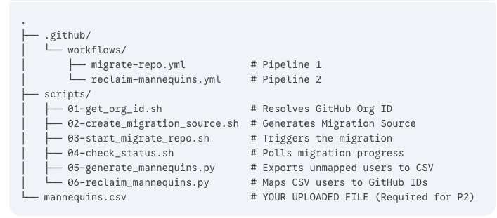

# ADO to GitHub Migration & Mannequin Reclamation
This repository contains a two-step automated workflow to migrate repositories from Azure DevOps (ADO) to GitHub Enterprise, including the process of "reclaiming" mannequins to map ADO identities to GitHub users.

## Prerequisites
Before running the pipelines, ensure the following GitHub Actions Secrets are configured in your repository:
* GH_PAT - GitHub Personal Access Token with repo, admin:org, and read:user scopes.
* ADO_PAT - Azure DevOps PAT with Code (Read) permissions.
* ORG_NAME - The target GitHub Organization name.

## Workflows
There are 2 workflows. Artifacts fo first workflow are to be used in second wrkflow.

### 1. Migrate Repo & Export Mannequins
This pipeline handles the heavy lifting of moving the code and identifying the users who need to be mapped.

 #### What it does:
 * Generates the necessary Migration Source IDs via GitHub GraphQL API.
 * Initiates the repository migration from ADO to GitHub.
 * Polls the migration status until completion.
 * Generates a mannequins.csv file containing all identities from the source repo that don't have a GitHub match

 #### How to run
 * Navigate to Actions > 1. Migrate Repo & Export Mannequins.
 * Click Run workflow.
 * Provide the ADO Repo URL and the New GitHub Repo Name.
 * Once finished, download the mannequins-to-edit artifact from the run summary

### 2. Reclaim Mannequins
After the migration, you must map the exported "mannequins" to actual GitHub usernames so their contribution history is correctly attributed.

 #### What it does:
 * Reads the mannequins.csv file.
 * Uses the GitHub API to invite/link those placeholder identities to real GitHub users.

 #### How to run:
 * Open the mannequins.csv you downloaded from Pipeline #1.
 * Edit the CSV: Add the target GitHub usernames in the appropriate column
 * Commit the CSV: Upload/Commit this updated mannequins.csv to the root of this repository.
 * Navigate to Actions > 2. Reclaim Mannequins.
 * Click Run workflow.

## Repository Structure

